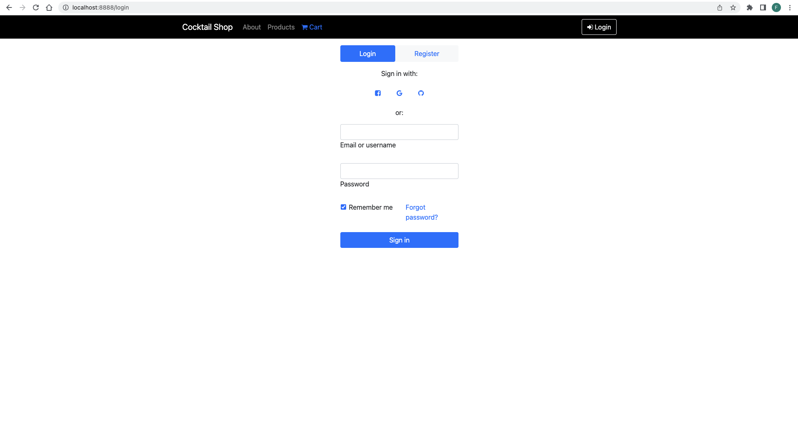
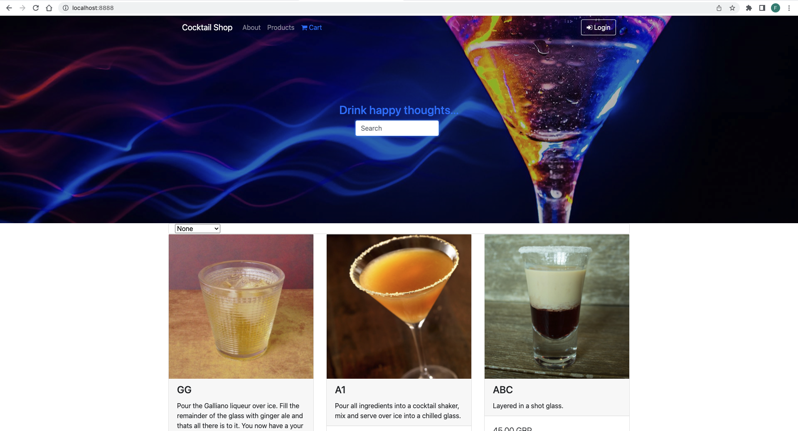
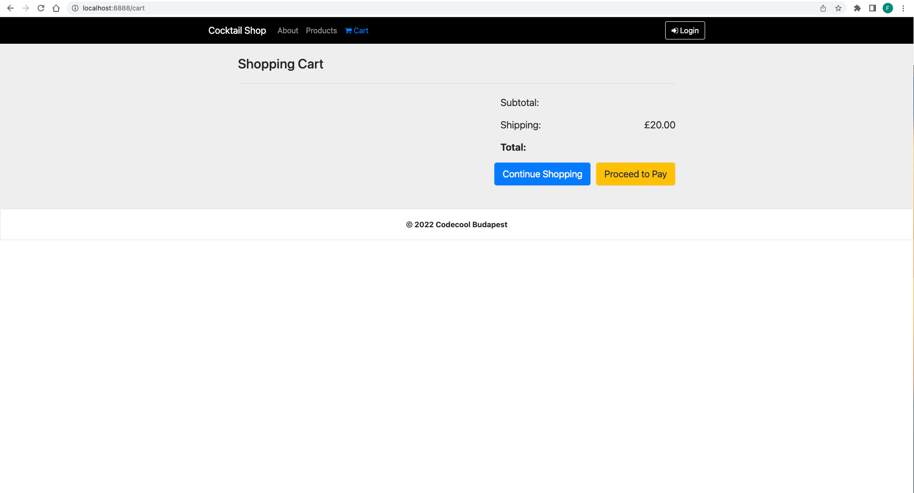

[![Contributors][contributors-shield]][contributors-url]

<!-- PROJECT LOGO -->
 

    
  <h2 align="center" style="font-weight: bold">Online Coctail Webshop</h2>

<!-- TABLE OF CONTENTS -->

  
Table of Contents

  <ol>
    <li>
      <a href="#about-the-project">About The Project</a>
      <ul>
        <li><a href="#built-with">Built With</a></li>
      </ul>
    </li>
    <li>
      <a href="#getting-started">Getting Started</a>
      <ul>
        <li><a href="#prerequisites">Prerequisites</a></li>
        <li><a href="#installation">Installation</a></li>
      </ul>
    </li>
    <li><a href="#usage">Usage</a></li>
    <li><a href="#contact">Contact</a></li>
  </ol>

<!-- ABOUT THE PROJECT -->
## About The Project

`Everyone loves to buy and sell stuff but we need a shop for that! In this project the goal is to build one the most common type of websites on the web: an online eCommerce web-application, where users can browse products, add them into a shopping cart, checkout items and make payments.` 

* This project uses a Public API where receives all the resources. The project's purpose is to create a webapp, an online webshop using the OOP Principles. Several technologies were used in the project development, mainly built on a Jetty Web Server. Apache Maven is the software project management of the project, where the Jetty Web Server is configured too.

* Advanced OOP concepts are used in the project inheritance, implemented abstract classes, interfaces, uses DAOs for object handling, and more. Separated every logical layer intp different modules,like: Model, Service, Controller, and others.

* Searching among drinks is done with Javascript filetring, DOM manipulation.

* All code is pushed to GitHub repository by atomic commits.

The application looks like this when the Jetty web server is running, reachable on the localhost:8888 port.

  - Login Page

 

  - Landing Page

  - Cart page

(<a href="#readme-top">back to top</a>)

### Built With

This section list major frameworks/libraries used to build and develop the project.

[![Java][java.com]][java-url]
[![Maven][maven.com]][maven-url]
[![HTML][html.com]][html-url]
[![JavaScript][javascript.com]][javascript-url]
[![CSS][css.com]][css-url]

(<a href="#readme-top">back to top</a>)

## Prerequisites

* Java

<!-- CONTACT -->
## Contact

MattheWhite - Fehér Mátyás

[![LinkedIn][linkedin-shield]][linkedin-url]
[![GitHub][github-shield]][github-url]

Project Link: [https://github.com/MattheWhite/online-shop](https://github.com/MattheWhite/online-shop)

(<a href="#readme-top">back to top</a>)

<!-- MARKDOWN LINKS & IMAGES -->
<!-- https://www.markdownguide.org/basic-syntax/#reference-style-links -->
[contributors-shield]: https://img.shields.io/github/contributors/MattheWhite/online-shop.svg?style=for-the-badge
[contributors-url]: https://github.com/MattheWhite/online-shop/graphs/contributors
[linkedin-shield]: https://img.shields.io/badge/-LinkedIn-black.svg?style=for-the-badge&logo=linkedin&colorB=349
[linkedin-url]: https://www.linkedin.com/in/matyas-feher/
[github-shield]: https://img.shields.io/badge/-GitHub-black.svg?style=for-the-badge&logo=github&colorB=947
[github-url]: https://github.com/MattheWhite
[java.com]: https://img.shields.io/badge/Java-black.svg?style=for-the-badge&logo=java&colorB=yellow
[java-url]: https://dev.java/
[maven.com]: https://img.shields.io/badge/Apache%20Maven-C71A36?style=for-the-badge&logo=Apache%20Maven&logoColor=white
[maven-url]: https://maven.apache.org/index.html
[javascript.com]: https://img.shields.io/badge/javascript-%23323330.svg?style=for-the-badge&logo=javascript&logoColor=%23F7DF1E
[javascript-url]: https://javascript.com/
[css.com]: https://img.shields.io/badge/css3-%231572B6.svg?style=for-the-badge&logo=css3&logoColor=white
[css-url]: https://en.wikipedia.org/wiki/CSS
[html.com]: https://img.shields.io/badge/html5-%23E34F26.svg?style=for-the-badge&logo=html5&logoColor=white
[html-url]: https://en.wikipedia.org/wiki/HTML5
